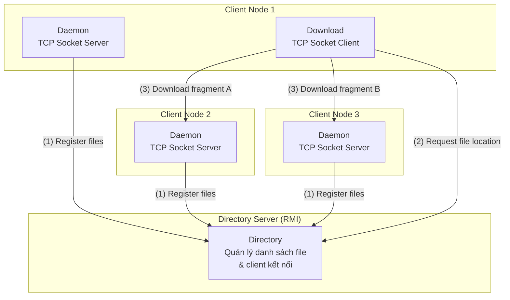

# 🧠 Brainstorm: SongSong Project - Parallel Download Infrastructure

## 📄 Tóm Tắt Đề Bài

**Nguồn**: [subjet-usth-2026.pdf](file:///c:/Users/Admin/songsong_project/subjet-usth-2026.pdf) | **Deadline**: 18/03/2026 (noon, giờ Pháp = **18h00 giờ Việt Nam**)
**Hình thức**: Làm theo cặp (2 sinh viên) | **Nộp**: Report (<5 trang) + Source code (.tgz < 500KB)

### Mục tiêu
Thiết kế và triển khai hệ thống **tải file song song** (parallel download) từ nhiều nguồn, tương tự cơ chế **BitTorrent** nhưng đơn giản hơn.

---

## 🏗️ Kiến Trúc Hệ Thống (3 Components)



### Component 1: Directory (RMI Server)
| Thuộc tính | Chi tiết |
|------------|----------|
| **Công nghệ** | Java RMI |
| **Chức năng** | Lưu danh sách file trên từng client, cung cấp thông tin khi có yêu cầu tải |
| **Khởi chạy** | `java Directory` |
| **Dữ liệu** | `Map<fileName, List<clientAddress>>` |

### Component 2: Daemon (TCP Socket Server)
| Thuộc tính | Chi tiết |
|------------|----------|
| **Công nghệ** | Java TCP Socket |
| **Chức năng** | Đăng ký file có sẵn với Directory, phục vụ tải fragment cho client khác |
| **Khởi chạy** | `java Daemon` (trên mỗi client node) |
| **Hoạt động** | Khi khởi động → quét folder → đăng ký file list lên Directory |

### Component 3: Download (TCP Socket Client)
| Thuộc tính | Chi tiết |
|------------|----------|
| **Công nghệ** | Java TCP Socket |
| **Chức năng** | Tải file song song từ nhiều nguồn |
| **Khởi chạy** | `java Download <filename>` |
| **Hoạt động** | Hỏi Directory → nhận danh sách sources → chia fragment → tải song song |

---

## 📋 Yêu Cầu Dự Án

### ✅ BẮT BUỘC (Mandatory)

#### 1. Basic Prototype
- [ ] Directory RMI server hoạt động
- [ ] Daemon đăng ký file lên Directory
- [ ] Download chia file thành fragments
- [ ] Tải song song từ nhiều sources
- [ ] Ghép fragments thành file hoàn chỉnh

#### 2. Parallelism Validation (Đo hiệu năng)
- [ ] Đo thời gian tải với số nguồn tăng dần (1, 2, 3, 4... sources)
- [ ] Vẽ đồ thị hiệu năng (performance curve)
- [ ] So sánh tải song song vs. tải tuần tự
- [ ] **Quan trọng**: Test trên mạng chậm (Internet, không LAN) để thấy rõ sự khác biệt

### 🌟 NÂNG CAO (Chọn 1-2 trong 3)

#### Enhancement A: Failure & Disconnection Handling
- Khi client bị disconnect giữa chừng → tự động chuyển fragment sang client khác
- **Độ khó**: ⭐⭐⭐ Medium
- **Giá trị**: Cao - thể hiện tính robust của hệ thống

#### Enhancement B: Dynamic Adaptation
- Tự động phát hiện client mới kết nối vào Directory
- Tự động xử lý client bị ngắt kết nối
- **Độ khó**: ⭐⭐ Medium-Low
- **Giá trị**: Trung bình - tương đối dễ implement

#### Enhancement C: Optimize Source Selection
- Chọn source dựa trên load hiện tại (số download đang chạy)
- **Độ khó**: ⭐⭐⭐⭐ High
- **Giá trị**: Cao - thể hiện khả năng tối ưu hóa

#### Enhancement D: Data Compression
- Nén dữ liệu trước khi truyền để tăng tốc
- **Độ khó**: ⭐ Low
- **Giá trị**: Thấp-Trung bình - dễ implement, kết quả rõ ràng

---

## 🧠 Phân Tích Các Phương Án Tiếp Cận

### Option A: Java Thuần (Chuẩn Đề Bài) ⭐ RECOMMENDED

**Mô tả**: Implement đúng theo đề bài sử dụng Java RMI + TCP Socket

**Tech Stack**:
- Java RMI cho Directory
- Java TCP Socket cho Daemon/Download
- Java `java.util.concurrent` cho parallel threads
- Java NIO cho file I/O

✅ **Pros:**
- Đúng yêu cầu đề bài 100%
- Giảng viên expect Java → dễ chấm điểm
- RMI + Socket là kiến thức cốt lõi của môn học
- Không cần thêm dependencies

❌ **Cons:**
- RMI hơi cũ, API phức tạp
- Error handling với RMI không intuitive

📊 **Effort:** Medium | ⏰ ~3-4 ngày

---

### Option B: Java + Enhanced Libraries

**Mô tả**: Java nhưng dùng thêm Netty cho networking

✅ **Pros:**
- Performance cao hơn TCP Socket thuần
- Non-blocking I/O native

❌ **Cons:**
- Thêm dependency (đề bài không yêu cầu)
- Overkill cho project nhỏ
- Giảng viên có thể thắc mắc

📊 **Effort:** High | ⏰ ~5-6 ngày

---

### Option C: Python Implementation

**Mô tả**: Dùng Python với `xmlrpc` thay RMI, `socket` cho TCP

✅ **Pros:**
- Code ngắn gọn hơn nhiều
- Debug nhanh hơn
- Prototype nhanh

❌ **Cons:**
- **Đề bài yêu cầu Java** (xem lại command: `java Directory`, `java Daemon`)
- GIL của Python hạn chế true parallelism
- Giảng viên có thể trừ điểm

📊 **Effort:** Low | ⏰ ~2 ngày

---

## 💡 Recommendation

**Option A: Java Thuần** là lựa chọn tốt nhất vì:
1. **Đúng yêu cầu** đề bài (các command mẫu đều là `java ...`)
2. **Thể hiện kiến thức** RMI + Socket mà môn học muốn kiểm tra
3. **Effort vừa phải** cho deadline 5 ngày

### 🎯 Chiến Lược Enhancement (Chọn 2):
1. **Enhancement A (Failure Handling)** + **Enhancement D (Compression)** là combo tốt nhất:
   - A thể hiện tính robust → điểm cao
   - D dễ implement → nhanh gọn, kết quả đo lường rõ ràng

---

## 📅 Timeline Đề Xuất (5 ngày)

| Ngày | Công việc | Deliverable |
|------|-----------|-------------|
| **Ngày 1** (13/03) | Thiết kế + Setup project + Directory RMI | Directory server chạy được |
| **Ngày 2** (14/03) | Daemon + file registration + TCP protocol | Daemon đăng ký file thành công |
| **Ngày 3** (15/03) | Download parallel + fragment merging | Basic prototype hoàn chỉnh |
| **Ngày 4** (16/03) | Parallelism test + Enhancement A & D | Đồ thị hiệu năng + features nâng cao |
| **Ngày 5** (17/03) | Report + Testing + Package (.tgz) | Nộp bài trước 18h00 ngày 18/03 |

---

## 🔧 Cấu Trúc Project Đề Xuất

```
songsong/
├── src/
│   ├── directory/
│   │   ├── DirectoryInterface.java    # RMI Interface
│   │   ├── DirectoryImpl.java         # RMI Implementation
│   │   └── DirectoryServer.java       # Main launcher
│   ├── daemon/
│   │   ├── Daemon.java                # TCP Socket Server
│   │   ├── FileManager.java           # Quản lý file local
│   │   └── FragmentHandler.java       # Xử lý fragment request
│   ├── download/
│   │   ├── Download.java              # Main download client
│   │   ├── FragmentDownloader.java     # Thread tải từng fragment
│   │   └── FileAssembler.java         # Ghép fragments
│   └── common/
│       ├── FileInfo.java              # Metadata file
│       ├── Protocol.java              # TCP Protocol constants
│       └── Config.java                # Configuration
├── test/
│   └── PerformanceTest.java           # Benchmark script
├── report/
│   └── report.pdf                     # Báo cáo (<5 trang)
├── Makefile                            # Build automation
└── README.md                           # Hướng dẫn chạy
```

---

## ⚠️ Lưu Ý Quan Trọng

> [!CAUTION]
> **Deadline**: 18/03/2026 trưa giờ Pháp = **18h00 giờ Việt Nam** (còn ~5 ngày)

> [!IMPORTANT]
> - Test hiệu năng PHẢI trên mạng chậm (Internet), KHÔNG phải LAN
> - Source code archive < 500KB, chỉ chứa source code
> - Report < 5 trang: manual chạy + kết quả đạt được

> [!TIP]
> - Dùng cloud VM (AWS/GCP free tier) ở xa để test parallel performance thực tế
> - Hoặc test giữa máy ở USTH và máy ở nhà
